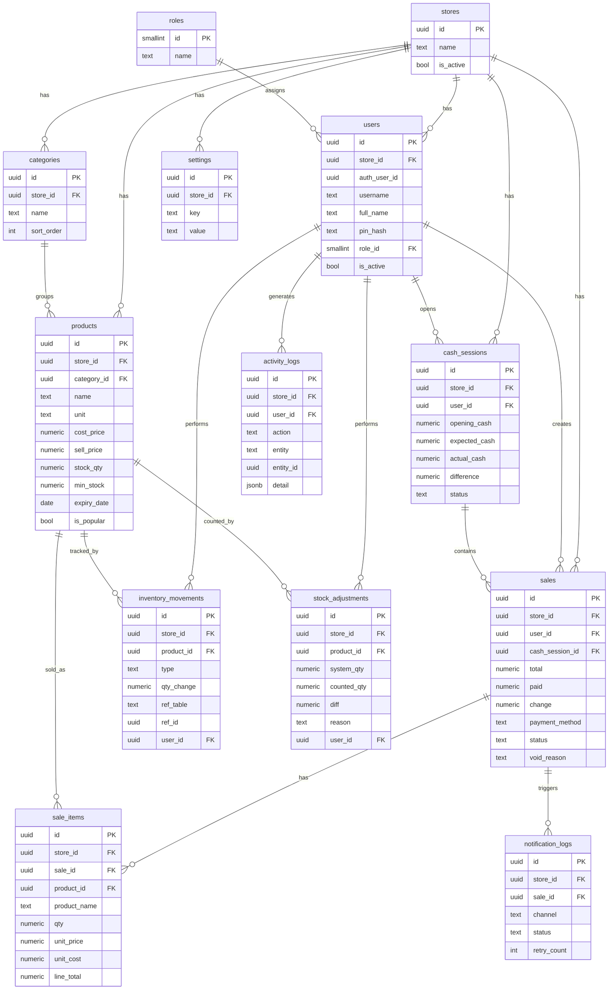

# ER Diagram — Stock Manager (POS + Inventory)

> เวอร์ชัน 1.0 (MVP) · ร้าน Gift Store · single store (SaaS-ready ผ่าน `store_id`)
> หมายเหตุ: **ไม่มี barcode ในโมเดลข้อมูลโดยเจตนา**

---

## 1. Mermaid ER Diagram



---

## 2. คำอธิบายความสัมพันธ์ (Relationships)

| ความสัมพันธ์ | แบบ | คำอธิบาย |
|---|---|---|
| stores → ทุกตารางธุรกิจ | 1:N | ทุกตารางมี `store_id` เพื่อแยกข้อมูลร้าน (รองรับ SaaS หลายร้านในอนาคต) |
| roles → users | 1:N | กำหนดสิทธิ์ owner/employee |
| categories → products | 1:N | จัดหมวดสินค้า (ลบหมวด → product.category_id = null) |
| users → sales | 1:N | ใครเป็นคนขายบิลนี้ |
| cash_sessions → sales | 1:N | บิลผูกกับกะเงินสด เพื่อคำนวณ expected_cash |
| sales → sale_items | 1:N | รายการสินค้าในบิล (ลบบิล → ลบ items, แต่บิลห้ามลบจริง) |
| products → sale_items | 1:N | สินค้าถูกขายในหลายบิล (เก็บ snapshot ชื่อ+ต้นทุน+ราคา) |
| products → inventory_movements | 1:N | ทุกการเปลี่ยนสต็อกของสินค้า |
| products → stock_adjustments | 1:N | การตรวจนับ/ปรับสต็อกด้วยมือ |
| sales → notification_logs | 1:N | สถานะการส่ง LINE ของบิล |
| users → activity_logs | 1:N | บันทึกการกระทำของผู้ใช้ |

---

## 3. กระแสข้อมูลหลัก (Main Data Flow)

### 3.1 ขายสินค้า (Product Sale)
```
พนักงานค้นชื่อสินค้า (Thai, trigram) → เลือกใส่ตะกร้า → กดรับเงิน
  → INSERT sales (status='completed', user_id, cash_session_id, total, payment_method)
  → INSERT sale_items[] (product_name, qty, unit_price, unit_cost snapshot, line_total)
```

### 3.2 ตัดสต็อก (Stock Deduction)
```
สำหรับแต่ละ sale_item:
  → UPDATE products.stock_qty = stock_qty - qty
  → INSERT inventory_movements (type='sale', qty_change = -qty, ref_table='sales', ref_id=sale.id)
กรณี void บิล:
  → INSERT inventory_movements (type='void_restock', qty_change = +qty) แล้วคืนสต็อก
```

### 3.3 คำนวณกะเงินสด (Cash Session)
```
เปิดกะ: INSERT cash_sessions (opening_cash, status='open')
ระหว่างกะ: sales (payment_method='cash') ผูก cash_session_id
ปิดกะ:
  expected_cash = opening_cash + SUM(sales.total where cash & completed ในกะ)
  actual_cash   = เงินนับจริง
  difference    = actual_cash - expected_cash
  → UPDATE cash_sessions (..., status='closed', closed_at)
```

### 3.4 ประวัติการขายรายวัน (Daily Sales History)
```
SELECT จาก sales JOIN users JOIN sale_items
WHERE store_id = ? AND created_at::date = เลือกวัน
แสดง: เวลา · พนักงาน · สินค้า · จำนวน · ยอดรวม · วิธีจ่าย · สถานะ
(ใช้ index: idx_sales_store_created)
```

### 3.5 แจ้งเตือน LINE (LINE Notification)
```
หลัง INSERT sales (completed):
  → INSERT notification_logs (sale_id, channel='line', status='pending')
  → ส่ง async ผ่าน LINE Messaging API push message ไปยัง owner user id (จาก settings)
  → สำเร็จ: UPDATE status='sent' | ล้มเหลว: status='failed', error, retry_count++
(การส่ง LINE ไม่บล็อกหน้าขาย และไม่ทำให้บิลล้มเหลว)
```

### 3.6 บันทึกกิจกรรม (Activity Logging)
```
ทุก action สำคัญ (login, แก้สินค้า/ราคา, void บิล, รับของ, ปรับสต็อก, เปิด/ปิดกะ, จัดการพนักงาน, แก้ settings):
  → INSERT activity_logs (user_id, action, entity, entity_id, detail jsonb {before, after})
append-only: ไม่มี policy update/delete → แก้/ลบไม่ได้
```

---

## 4. ทำไมไม่มี Barcode ในโมเดลข้อมูล

- **ลูกค้ายืนยันไม่ต้องการ** — ไม่ใช่แค่ "ไม่ทำตอนนี้" แต่ "ไม่ใช้"
- ร้านโชห่วยมีสินค้าจำนวนมากที่**ไม่มีบาร์โค้ด** (บุหรี่แยกซอง เหล้าแบ่งขาย ลูกอมเม็ด ของชั่งกิโล) → ต้องพิมพ์ฉลากเอง = ภาระเพิ่ม
- การ**ค้นด้วยชื่อภาษาไทย (pg_trgm) + ปุ่มสินค้าขายดี** เร็วพอและเข้าใจง่ายกว่าสำหรับพนักงานใหม่
- ใส่คอลัมน์ `barcode` "เผื่อไว้" = dead column ที่ทำให้สคีมาดูซับซ้อนโดยไม่จำเป็น → ขัดหลัก "ไม่ซับซ้อน ดูง่าย"
- **ถ้าลูกค้าเปลี่ยนใจ:** เพิ่มคอลัมน์ `barcode text unique` + unique index ภายหลังได้ทันที โดยไม่กระทบโครงสร้างเดิม (เป็นงาน V2)

---

## 5. ทำไมไม่มี Offline Mode ใน MVP

- Offline (IndexedDB + Service Worker + sync) เพิ่ม**ความซับซ้อนมหาศาล**: การแก้ conflict เมื่อสองเครื่องขายสินค้าเดียวกันพร้อมกัน, สต็อกติดลบ, การ merge บิล/เงินสด
- ขัดหลักการ MVP **"ไม่ซับซ้อน ดูง่าย"** โดยตรง และเพิ่มความเสี่ยงข้อมูลพังสูง
- ร้านใช้งานบน**เดสก์ท็อปในร้านเป็นหลัก** + เน็ตบ้าน/4G ราคาถูก → online-first ยอมรับได้ในระยะแรก
- ทางบรรเทาแบบง่าย: แนะนำเน็ตสำรอง 4G (mobile hotspot)
- **เลื่อนเป็น Future Version** เมื่อระบบ online เสถียรและมีฐานผู้ใช้จริงแล้วค่อยลงทุนทำ sync engine อย่างจริงจัง

---

## 6. หลักการออกแบบที่ยึด (Design Principles)

1. **ไม่ลบข้อมูลการเงิน** — `sales` ไม่มี DELETE policy; ยกเลิกด้วย `status='void'` + เหตุผล
2. **ทุกการเคลื่อนไหวสต็อกถูกบันทึก** — `inventory_movements` เป็น source of truth ตรวจสอบของหายย้อนหลังได้
3. **เก็บ snapshot ณ เวลาขาย** — `sale_items` เก็บ `unit_price`, `unit_cost`, `product_name` เพื่อกำไรย้อนหลังถูกต้องแม้ราคาเปลี่ยน
4. **แยกสิทธิ์ owner/employee** — ผ่าน RLS (`is_owner()`) + view `products_employee` ที่ไม่มีต้นทุน
5. **store_id ทุกตาราง** — เตรียม SaaS หลายร้านโดยไม่ทำ UI หลายสาขาใน MVP
6. **ไม่ over-engineer** — ไม่มี barcode, ไม่มี offline, ไม่มีตารางที่ MVP ไม่ใช้
