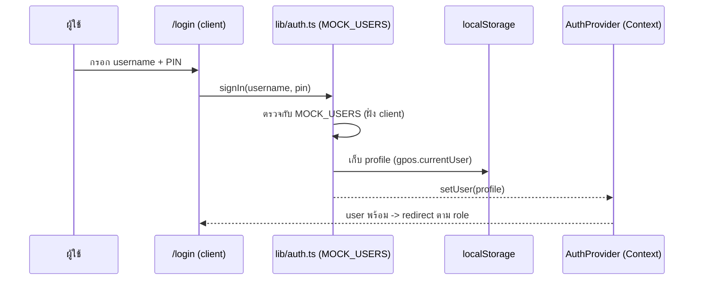
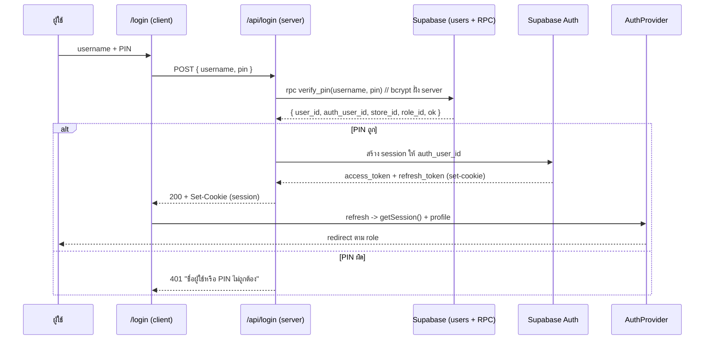
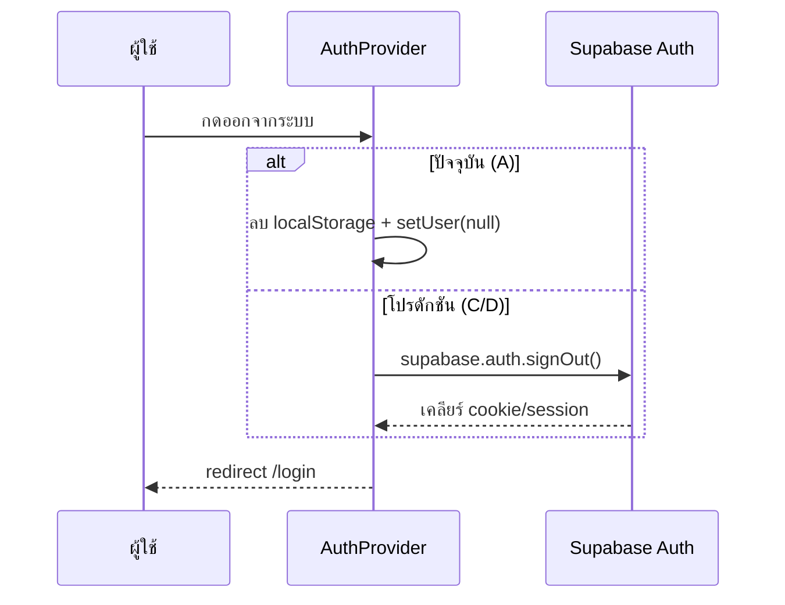

# Auth Architecture — Grocery POS (ร้าน Gift)

> เวอร์ชัน 1.0 · Phase 2.5 (เอกสารสถาปัตยกรรม ไม่ใช่โค้ด)
> เป้าหมาย: วางสถาปัตยกรรม auth ให้ RPC ทำงานกับ `auth.uid()` + RLS ได้ในอนาคต โดยไม่ต้องแก้ RPC

---

## 1. สรุปสั้น

ระบบใช้ **custom username + PIN** (ไม่ใช่ email/password ของ Supabase Auth) เพราะพนักงานหน้าร้านพิมพ์ PIN เร็วกว่า
หัวใจของการ migration: ทุก RPC ผูกตัวตนผ่าน **`users.auth_user_id` = `auth.uid()`** ดังนั้นถ้าวันหนึ่งเราออก Supabase session จริงและ **เติม `auth_user_id` ให้ทุก user** → RPC เดิมทำงานต่อได้ทันทีโดยไม่ต้องแก้โค้ด

---

## 2. Current Auth Flow (Phase A — demo ปัจจุบัน)



ลักษณะปัจจุบัน:
- Mock users อยู่ใน `lib/auth.ts` (gift/1111, somchai/2222)
- ตรวจ PIN **ฝั่ง client**
- session = `localStorage` key `gpos.currentUser`
- **ไม่มี Supabase session → `auth.uid()` เป็น null**
- RPC ที่เรียก (อนาคต) จะวิ่งผ่าน **service_role** เท่านั้น (RLS ถูก bypass, ความปลอดภัยอยู่ที่ validate ภายใน RPC)

---

## 3. ความเสี่ยงของ Current Flow

| ความเสี่ยง | ระดับ | คำอธิบาย |
|---|---|---|
| PIN ตรวจฝั่ง client | สูง | MOCK_USERS + PIN อยู่ใน JS bundle ใครก็อ่านได้ — ใช้ได้เฉพาะ demo |
| localStorage session | กลาง | ปลอม/แก้ profile ได้ (เปลี่ยน role เป็น owner เอง) |
| `auth.uid()` = null | สูง | RLS ไม่ทำงาน ต้องพึ่ง service_role → ถ้า key หลุดคือเข้าถึงทุก store |
| ไม่มี session expiry | กลาง | ค้างล็อกอินถาวรจนกว่าจะ logout |
| client-side route guard | ต่ำ | กัน UX เท่านั้น ไม่ใช่ security boundary (ตัวจริงคือ RLS/RPC) |

---

## 4. Production Auth Flow (เป้าหมาย Phase B–D)



จุดสำคัญ: เมื่อมี Supabase session แล้ว ทุก request ฝั่ง server จะมี `auth.uid()` = `auth_user_id` ของผู้ใช้ → RLS + guard ใน RPC ทำงานครบ

---

## 5. Session Lifecycle

| ขั้น | ปัจจุบัน (A) | โปรดักชัน (C/D) |
|---|---|---|
| สร้าง session | เขียน localStorage | Supabase ออก JWT + refresh token (httpOnly cookie) |
| อ่าน session | `getCurrentUser()` จาก localStorage | `supabase.auth.getSession()` (server/client) |
| ต่ออายุ | ไม่มี | refresh token อัตโนมัติ (middleware) |
| หมดอายุ | ไม่มี | JWT อายุสั้น (เช่น 1 ชม.) refresh จนกว่าจะหมด/ถูกเพิกถอน |
| sync ข้ามแท็บ | ไม่มี | `onAuthStateChange` |

**แนะนำ:** เพิ่ม middleware (`middleware.ts`) เพื่อ refresh session ทุก request และกัน route ฝั่ง server

---

## 6. Logout Flow



---

## 7. User Context Flow (เหมือนกันทั้ง A และ D)

```
AuthProvider (lib/auth-context.tsx)
  └─ user: { id, store_id, role, role_id, full_name, username, is_active }
       ├─ useAuth()        -> /login, AppShell, ทุกหน้า
       ├─ useUser()        -> ทางลัด + isOwner
       ├─ canAccessPath()  -> route guard ใน AppShell
       └─ defaultRouteFor()-> redirect หลัง login
```

โครง context **ไม่เปลี่ยน** ระหว่าง migration — เปลี่ยนแค่ "แหล่งที่มา" ของ user (localStorage → Supabase session)

---

## 8. store_id โหลดมาอย่างไร

| Phase | ที่มา |
|---|---|
| A (ปัจจุบัน) | ฝังใน MOCK_USERS / `NEXT_PUBLIC_STORE_ID` |
| C/D (โปรดักชัน) | หลังยืนยันตัวตน อ่านจากแถว `users.store_id` (where `auth_user_id = auth.uid()`) |

`store_id` ถูกส่งเป็น `p_store_id` เข้า RPC และ RPC ตรวจซ้ำว่า user สังกัด store นั้นจริง → กัน cross-store

---

## 9. role_id โหลดมาอย่างไร

| Phase | ที่มา |
|---|---|
| A | ฝังใน MOCK_USERS (`role_id`: 1=owner, 2=employee) |
| C/D | อ่านจาก `users.role_id` ในฐานข้อมูล (ไม่ไว้ใจค่าจาก client) |

สำคัญ: RPC ที่จำกัดสิทธิ์ (void/cash session/profit) อ่าน `role_id` **จากตาราง users ใน DB** ไม่ใช่จาก JWT claim → ปลอดภัยและไม่ต้องแก้แม้เปลี่ยนวิธี login

---

## 10. RPC รับ auth.uid() อย่างไร

```
Next.js (server, มี session cookie)
   │  supabase.rpc('create_sale', { p_user_id, p_store_id, ... })
   ▼
Postgres: ฟังก์ชัน SECURITY DEFINER
   ├─ auth.uid()  ← มาจาก JWT ใน request (Supabase ใส่ให้อัตโนมัติ)
   ├─ guard: auth.uid() != null AND users.auth_user_id != auth.uid()  -> AUTH_MISMATCH
   └─ ถ้า auth.uid() = null (service_role) -> เชื่อ backend (ข้าม guard)
```

**เงื่อนไขเดียวที่ทำให้ทุกอย่างทำงาน:** ต้องเติม `users.auth_user_id` ให้ตรงกับ `auth.uid()` ของ Supabase Auth ตอนสร้าง/ลิงก์บัญชี (ดู migration plan Phase C)

---

## 11. หลักการที่ยึด

1. ตัวตนผูกผ่าน `users.auth_user_id` ↔ `auth.uid()` — เป็น "สวิตช์" เดียวที่เปิด RLS
2. role/store อ่านจาก DB เสมอ ไม่ไว้ใจ client
3. RPC validate ภายในตัวเอง (SECURITY DEFINER) → ปลอดภัยทั้งตอนเรียกด้วย JWT และ service_role
4. โครง AuthProvider/Context คงที่ → migration กระทบแค่ชั้น "แหล่ง session"
