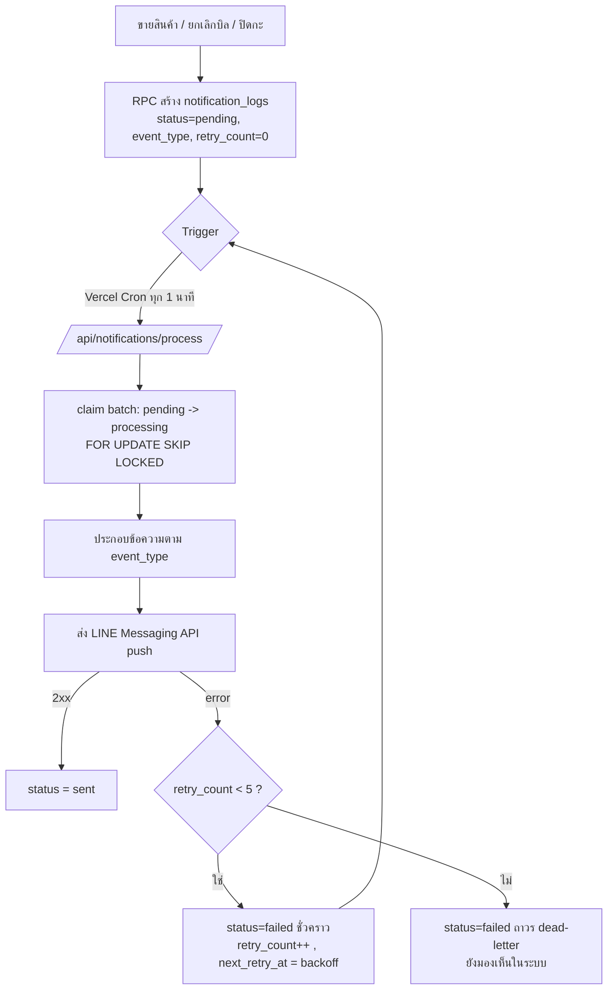
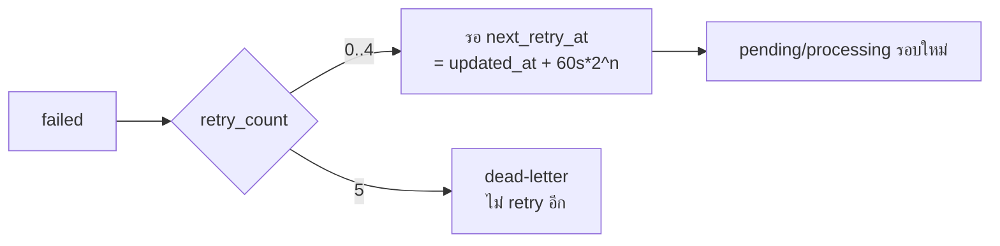

# LINE Notification Worker — Architecture

> เวอร์ชัน 1.0 · Phase 9 (เอกสารสถาปัตยกรรม — ยังไม่เขียน production code)
> คู่กับ [line-worker-implementation.md](line-worker-implementation.md)
> ใช้ตาราง `notification_logs` เดิม (ดู schema.sql + rpc-*.sql) — ส่ง LINE ฝั่ง server เท่านั้น

---

## 1. ภาพรวม

RPC ที่มีอยู่ (`create_sale`, `void_sale`, `close_cash_session`) สร้างแถว `notification_logs` สถานะ `pending` ไว้แล้ว 3 ชนิด: `event_type ∈ {sale, void, cash_close}`
**Worker** มีหน้าที่: ดึง pending → สร้างข้อความ → ส่ง LINE Messaging API → อัปเดตสถานะ → retry เมื่อล้มเหลว → กันส่งซ้ำ

Worker **ไม่ยุ่ง** กับ business logic เดิม — อ่าน/อัปเดตเฉพาะ `notification_logs` (+ อ่าน sales/sale_items/users/cash_sessions เพื่อประกอบข้อความ)

---

## 2. Notification Queue Flow



สถานะ (เสนอขยายจาก 3 → 4):
`pending` → `processing` (กำลังส่ง) → `sent` (สำเร็จ) / `failed` (ล้มเหลว, รอ retry หรือ dead-letter)

---

## 3. Retry Strategy

| กฎ | ค่า |
|---|---|
| retry_count เริ่ม | 0 |
| max retry | 5 (เกินแล้ว = dead-letter ถาวร) |
| failed ยังมองเห็น | ใช่ (ไม่ลบ — owner ตรวจได้) |
| backoff | exponential: `delay = 60s × 2^retry_count` (1, 2, 4, 8, 16 นาที) |
| เลือกงาน | เฉพาะแถวที่ `next_retry_at <= now()` (หรือ null) |
| กัน loop ไม่รู้จบ | หยุดที่ retry_count = 5 → ไม่หยิบอีก |



---

## 4. Idempotency Strategy (กันส่งซ้ำ)

ปัญหา: cron หลายรอบ/หลาย instance อาจหยิบแถวเดียวกันพร้อมกัน → ส่ง LINE ซ้ำ

**กลไก 3 ชั้น:**

1. **Atomic claim (lock):** เปลี่ยน `pending → processing` ด้วยคำสั่งเดียวแบบ atomic
   ```sql
   update notification_logs set status='processing', processing_at=now()
   where id in (
     select id from notification_logs
     where store_id=$1 and status='pending'
       and (next_retry_at is null or next_retry_at <= now())
     order by created_at
     limit $batch
     for update skip lock   -- ใครจองได้ก่อนเป็นเจ้าของ, instance อื่นข้าม
   )
   returning *;
   ```
   `FOR UPDATE SKIP LOCKED` = instance อื่นจะไม่หยิบแถวที่ถูกล็อก → ไม่ซ้ำ

2. **Processing status เป็นเจ้าของงาน:** มีเพียง worker ที่ flip เป็น `processing` สำเร็จเท่านั้นที่ส่ง LINE แถวนั้น

3. **กู้แถวค้าง (stuck recovery):** ถ้า worker crash กลางทาง แถวจะค้าง `processing`
   → reclaim: แถว `processing` ที่ `processing_at < now() - 5 min` ให้ตีกลับเป็น `pending`

> หมายเหตุ: 1 event = 1 แถว notification_logs (RPC สร้างครั้งเดียว) → ระดับ "สร้าง" ไม่ซ้ำอยู่แล้ว; idempotency โฟกัสที่ระดับ "ส่ง"
> LINE Messaging API ไม่มี idempotency key มาตรฐาน → ใช้ claim ป้องกันแทน (ส่งครั้งเดียวต่อแถว)

---

## 5. Message Templates (ไทย)

### 5.1 Sale (event_type = sale)
ข้อมูลจาก: `sales` + `sale_items` + `users` (ผ่าน sale_id)
```
🛒 มีการขายสินค้าใหม่

พนักงาน: {employee_name}
ยอดขาย: {total} บาท

สินค้า:
- {product_name} x{qty}
- {product_name} x{qty}

เวลา: {HH:mm}
```

### 5.2 Void (event_type = void)
ข้อมูลจาก: `sales` (status=void, void_reason, voided_by)
```
⚠️ มีการยกเลิกบิล

พนักงาน: {voided_by_name}
เหตุผล: {void_reason}
ยอดขาย: {total} บาท
เวลา: {HH:mm}
```

### 5.3 Cash Close (event_type = cash_close)
ข้อมูลจาก: cash session ที่เพิ่งปิด (ดู §8 ความเสี่ยง — ต้องมีตัวเชื่อม)
```
📊 สรุปปิดกะ

เงินที่ควรมี: {expected_cash} บาท
เงินที่นับได้: {actual_cash} บาท
ส่วนต่าง: {difference} บาท {🟢 ตรง / 🔴 ขาด / 🔴 เกิน}
เวลา: {HH:mm}
```

ปลายทาง: push message ไปยัง `LINE_OWNER_USER_ID` (เจ้าของร้าน)

---

## 6. Environment Variables

| ตัวแปร | ใช้ทำอะไร | ฝั่ง |
|---|---|---|
| `LINE_CHANNEL_ACCESS_TOKEN` | token ของ LINE Official Account (Messaging API) | server only |
| `LINE_OWNER_USER_ID` | LINE userId ของเจ้าของ (ปลายทาง push) | server only |
| `SUPABASE_SERVICE_ROLE_KEY` | worker อ่าน/อัปเดต notification_logs ข้าม RLS | server only |
| `NEXT_PUBLIC_SUPABASE_URL` | endpoint Supabase | ทั้งสอง |
| `CRON_SECRET` | กัน /api/notifications/process ถูกเรียกมั่ว | server only |
| `LINE_NOTIFY_BATCH_SIZE` (optional) | จำนวนต่อรอบ (default 20) | server only |

> ⚠️ ห้ามใส่ prefix `NEXT_PUBLIC_` กับ token/secret ใดๆ — จะหลุดขึ้น client bundle

---

## 7. Security Review

1. **service_role อยู่ server เท่านั้น** — `notification_logs` มี RLS (owner-only select); worker ต้องอ่าน/อัปเดตทุก store/แถว จึงใช้ service_role ที่ bypass RLS ได้ แต่รันใน Route Handler/Cron (server) ไม่มีวันอยู่ใน bundle (ไม่มี `NEXT_PUBLIC_`)
2. **LINE token ไม่ถึง frontend** — เก็บใน env server, เรียก LINE API จากฝั่ง server เท่านั้น client ไม่เคยเห็น token หรือ userId
3. **worker เข้าถึง notification_logs อย่างปลอดภัย** — ผ่าน claim แบบ atomic (`FOR UPDATE SKIP LOCKED`) กัน race/ซ้ำ + อ่านเฉพาะข้อมูลที่ต้องใช้ประกอบข้อความ
4. **/api/notifications/process ป้องกัน** — รับเฉพาะ (ก) cron ที่แนบ `Authorization: Bearer $CRON_SECRET` หรือ (ข) owner session; นอกนั้น 401 — ไม่เปิด anon
5. **ไม่ leak ข้อมูล** — endpoint คืนแค่สรุปจำนวน (processed/sent/failed) ไม่คืนเนื้อหาบิล

---

## 8. Known Risks

| ความเสี่ยง | ระดับ | แนวทาง |
|---|---|---|
| ~~cash_close ไม่มีตัวเชื่อมข้อมูลกะ~~ | ✅ แก้แล้ว (9A) | เพิ่ม `payload jsonb` + RPC close เขียนสรุปกะลง payload (ดู line-worker-schema.sql) |
| ~~schema ยังไม่มี processing/next_retry_at/payload~~ | ✅ แก้แล้ว (9A) | ALTER idempotent ใน line-worker-schema.sql |
| ส่งซ้ำเมื่อหลาย instance | กลาง | claim atomic + SKIP LOCKED (Phase 9C) |
| worker crash → แถวค้าง processing | กลาง | stuck recovery (processing_at timeout) (Phase 9C) |
| LINE rate limit / API ล่ม | กลาง | backoff + dead-letter + ส่งทีละ batch (Phase 9C) |
| เวลา (timezone) ในข้อความ | ต่ำ | format เป็น Asia/Bangkok |
| cron ไม่ทำงาน | กลาง | ปุ่ม "ส่งซ้ำ" ฝั่ง owner / alert เมื่อ pending ค้างนาน |
| แถวเก่า payload=null (ก่อน migration) | ต่ำ | worker fallback fetch จาก sale_id; cash_close เก่า → dead-letter/mark ด้วยมือ |
